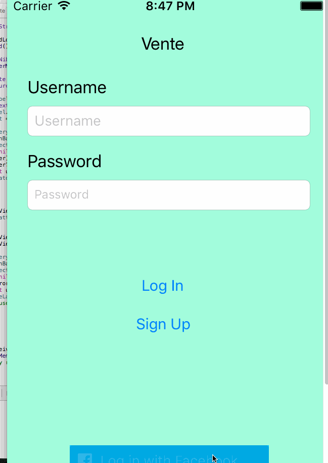

# Vente
An application to give people the power to connect and share meaningful interactions

# Time Spent
**30** Hours

##Required
- [X] User can make a profile and log in
- [X] User can log in with Facebook credentials
- [X] User can make events
- [X] User can see and join events around them
- [X] User can access all other user's profiles within a public event

##Optional Tier 1
- [X] Filter for events based on interests
- [ ] Allow user to search events based on name
- [X] Add tags for events relating to specific interests
- [ ] Group chat within each event
- [X] Check for a .ufl email address for security
- [X] Integrate Yelp API to pull events

##Optional Tier 2
- [X] Invite only vs public events
- [X] Follow other users
- [ ] Load events based on radius of created location
- [ ] Ability to see a user’s past events

##Optional Tier 3
- [ ] Integrate Uber API into chat for users to request rides
- [ ] Remake a past event
- [ ] Check-in feature when a person comes to an event (bump phones together? bluetooth? location check?)

##Optional Tier 4
- [ ] User can specify interests within profile
- [ ] Filter other users based on their interests
- [ ] Notification for user if somebody with mutual interest is nearby

##Optional Tier ???
- [ ] Nick's camera idea 

## Gif Walkthrough Sprint 1

## Gif Walkthrough Sprint 2

## Gif Walkthrough Sprint 3

