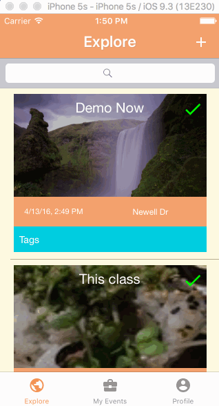
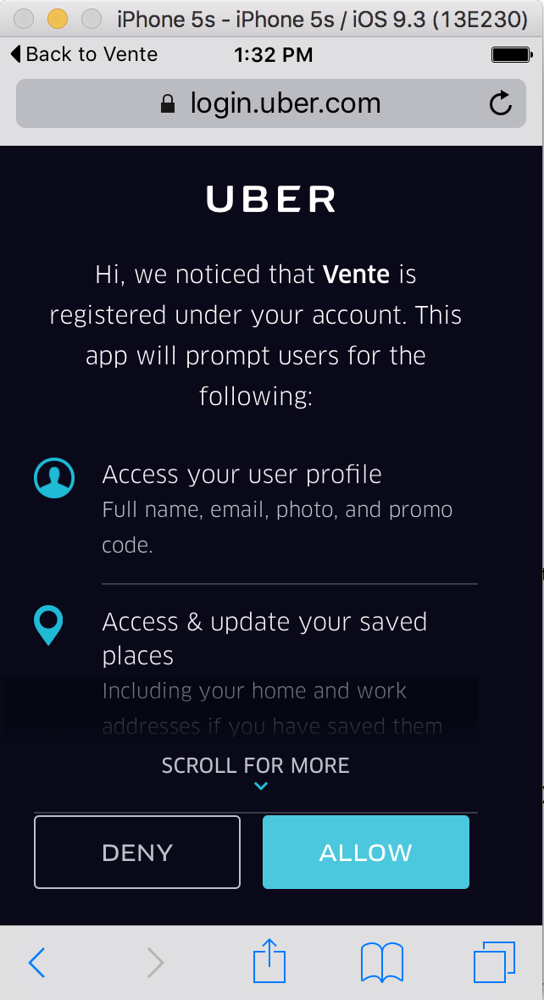

# Vente
An application to give people the power to connect and share meaningful interactions

# Time Spent
**110** Hours

##Required
- [X] User can make a profile and log in
- [X] User can log in with Facebook credentials
- [X] User can make events
- [X] User can see and join events around them
- [X] User can access all other user's profiles within a public event

##Optional Tier 1
- [X] Filter for events based on interests
- [X] Allow user to search events based on name
- [X] Add tags for events relating to specific interests
- [X] Group chat within each event
- [X] Check for a .ufl email address for security
- [X] Integrate Yelp API to pull events

##Optional Tier 2
- [X] Invite only vs public events
- [X] Follow other users
- [X] Load events based on radius of created location
- [X] Ability to see a user’s past events
- [X] Ability to see followers and following

##Optional Tier 3
- [X] Remake a past event
- [X] OAuth2 call to allow user to login to Uber
- [ ] Integrate Uber API into chat for users to request rides
- [ ] Check-in feature when a person comes to an event (bump phones together? bluetooth? location check?)

##UI 
- [X] Custom splash screen
- [ ] Splash screen animation
- [X] Custom search bars
- [X] Tableviews fade in
- [X] Subviews slide on the screen
- [X] Loading indicators
- [X] Alerts for bad data entry
- [X] Screen moves to match textfield
- [X] Clean color scheme

##AutoLayout
- [ ] Autolayout

##Optional Tier ???
- [ ] Nick's camera idea 

## Vente Gif Walkthrough

