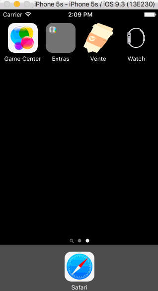

# Vente
An application to give people the power to connect and share meaningful interactions

##Required
- [X] User can make a profile and login
- [X] User can make events (set a certain radii)
- [X] User can see and join events around them
- [ ] Access to all people's profiles within a public event

##Optional Tier 1
- [ ] User can specify interests within profile
- [ ] Filter for users/events based on interests
- [ ] Add tags for events relating to specific interests
- [ ] Way to contact/message people within events
- [ ] Check for a .ufl email address for securit
- [ ] Integrate Yelp API to pull events

##Optional Tier 2
- [ ] Differentiate between group and peer2peer events
- [ ] Invite only vs public events
- [ ] Follow/add friends
- [ ] Ability to see a person’s past events

##Optional Tier 3
- [ ] Remake a past event
- [ ] Check-in feature when a person comes to an event (bump phones together? bluetooth?)

##Optional Tier 4
- [ ] Notification for user if somebody with mutual interest is nearby

##Optional Tier ???
- [ ] Nick's camera idea 

## Gif Walkthrough Sprint 1

